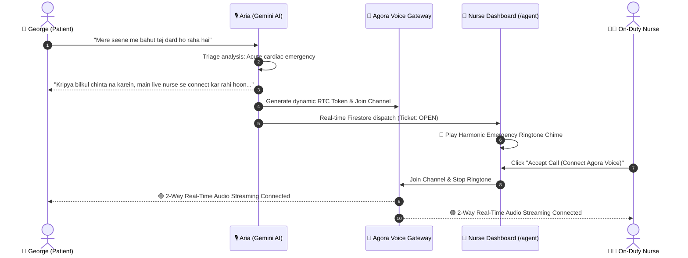

# 🏥 AgoraCare — Prototype Walkthrough & Mentor Review Guide

> **Prepared for:** Kamal Walia (Mentor)  
> **Project Name:** AgoraCare — AI-Powered Remote Patient Care & Real-Time Voice Emergency Escalation  
> **Track:** EchoSphere / Agora Conversational AI Hackathon  
> **Live Patient App:** [https://agoracare.vercel.app](https://agoracare.vercel.app)  
> **Live Nurse / Agent Dashboard:** [https://agoracare.vercel.app/agent](https://agoracare.vercel.app/agent)  
> **GitHub Repository:** [https://github.com/iamaanahmad/AgoraCare](https://github.com/iamaanahmad/AgoraCare)

---

## 🌟 Executive Summary

**AgoraCare** is a next-generation remote patient care and telehealth platform designed for elderly patients, chronic disease individuals, and remote caregivers. It bridges the critical gap between **autonomous conversational AI** and **human medical professionals**.

When a patient interacts with the system, **Aria (Conversational AI powered by Google Gemini 3.6 Flash & Genkit)** provides bilingual medical assistance in English, Hindi, and Hinglish. If acute symptoms or medical emergencies (e.g., chest pain, respiratory distress) are detected, AgoraCare **automatically triggers a real-time Agora RTC voice bridge**, alerting live hospital triage nurses and opening an instant two-way audio consultation channel.

---

## 🔗 Quick Access Links

| Portal | URL | Purpose |
| :--- | :--- | :--- |
| 🧑‍⚕️ **Patient Dashboard** | [agoracare.vercel.app](https://agoracare.vercel.app) | Daily health overview, medication schedule, vitals, prescriptions & voice assistant (Aria). |
| 🚨 **Nurse / Agent Portal** | [agoracare.vercel.app/agent](https://agoracare.vercel.app/agent) | Real-time emergency call queue, audio ringtone chime, one-click Agora voice call accept. |
| 💻 **Source Code (GitHub)** | [github.com/iamaanahmad/AgoraCare](https://github.com/iamaanahmad/AgoraCare) | Production-ready Next.js 15, React 19, TypeScript, and Agora RTC codebase. |

---

## 🧪 3-Minute Interactive Demo Walkthrough

To experience the full end-to-end real-time patient-nurse flow, open **Device 1 (Patient)** on a phone/browser tab and **Device 2 (Nurse)** on your computer:

---

### **Step 1: Bilingual Voice AI Assistant (Aria)**
1. On the [Patient App](https://agoracare.vercel.app), tap the **Floating Mic** icon at the bottom-right.
2. Toggle between **🇮🇳 Hinglish / English** and **🇮🇳 हिंदी** above the input bar.
3. Tap the microphone and ask:
   > *"When should I take my Lisinopril medication?"*  
   > *(or in Hindi: "Lisinopril tablet kab leni hai?")*
4. **Expected Result:** Aria checks George's schedule, responds with dosage timing, and speaks out loud with native Indian speech synthesis.

---

### **Step 2: Emergency Voice Escalation & Live Nurse RTC Call**
1. Keep the **[Nurse Dashboard](https://agoracare.vercel.app/agent)** open on Tab/Device 2.
2. On Tab/Device 1 (Patient), tap the microphone and speak:
   > *"Mere seene me bahut tej dard ho raha hai aur saans phool rahi hai"*  
   > *(or: "I have severe chest pain and cannot breathe")*
3. **What Happens in Real Time:**
   - **Aria Triage:** AI identifies high-risk chest pain, speaks a calming transfer message, and automatically enters the secure Agora voice channel.
   - **Nurse Alert:** The Nurse Dashboard immediately pops up an active emergency ticket and plays a **looping medical alert chime** (harmonic tri-tone chord).
   - **Agora Voice Connection:** Click **"Accept Call (Connect Agora Voice)"** on the nurse portal. The ringtone stops, and high-fidelity, low-latency, two-way audio streaming is established between the two devices.
   - Live controls (Mute Mic, End Call & Resolve) operate seamlessly.

---

### **Step 3: Daily Medication Timeline & Adherence**
* **URL:** [agoracare.vercel.app/medications](https://agoracare.vercel.app/medications)
* **Features:**
  - **Today's Timeline:** Chronologically sorted doses:
    - 🌅 **08:00 AM:** Lisinopril (10mg - Morning with breakfast)
    - ☀️ **01:00 PM:** Metformin (500mg - Afternoon with lunch)
    - 🌆 **06:30 PM:** Amlodipine (5mg - Evening with dinner)
    - 🌙 **09:00 PM:** Simvastatin (20mg - Bedtime)
  - **One-Click Adherence:** Mark doses as *Taken*, *Skipped*, or *Missed* with automatic adherence rate recalculation.

---

### **Step 4: Interactive Vitals & Responsive Charts**
* **URL:** [agoracare.vercel.app/vitals](https://agoracare.vercel.app/vitals)
* **Features:**
  - Live metric cards: Heart Rate (bpm), Blood Pressure (mmHg), and Respiratory rate.
  - Interactive dual-area Blood Pressure charts and smooth Heart Rate trend lines that adapt seamlessly to mobile and desktop screen widths.

---

### **Step 5: AI Prescription OCR**
* **URL:** [agoracare.vercel.app/prescriptions](https://agoracare.vercel.app/prescriptions)
* **Features:**
  - Upload or capture any medical prescription image.
  - Gemini Flash extracts medication names, dosage, frequency, and instructions into a structured format ready to import directly into the patient's schedule.

---

## 🛠️ Technical Architecture & Key Innovations

| Layer | Technologies Used | Implementation Details |
| :--- | :--- | :--- |
| **Real-Time Voice** | **Agora RTC Web SDK v4** | Sub-second audio streaming, dynamic token authentication, automatic noise suppression (ANS), acoustic echo cancellation (AEC). |
| **Conversational AI** | **Google Gemini 3.6 Flash & Genkit** | Bilingual Hinglish/Hindi understanding, symptom triage logic, structured safety guardrails. |
| **Audio Engine** | **Web Audio API** | Procedural harmonic emergency alert chimes (`880Hz`, `1174Hz`, `1318Hz`) with zero external audio assets. |
| **Data & State** | **Firebase Firestore & Auth** | Real-time ticket synchronization, idempotent deterministic seeding, family circle role management. |
| **Frontend** | **Next.js 15 (App Router), React 19, Tailwind CSS** | Mobile-first responsive glassmorphism UI, Lucide icons, dynamic Edge SVG branding. |

---

## 👨‍💻 Author & Repository

* **Lead Developer:** Amaan Ahmad
* **GitHub Repository:** [https://github.com/iamaanahmad/AgoraCare](https://github.com/iamaanahmad/AgoraCare)
* **Live Deployment:** [https://agoracare.vercel.app](https://agoracare.vercel.app)
